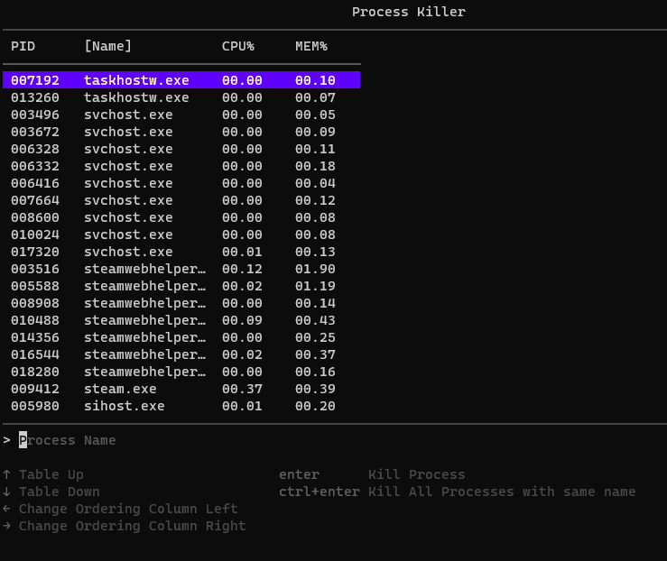

# pkill (Process Killer)

`pkill` is a simple process killer CLI App made with `go`

I made it just to experiment with `go` + CLI libs (https://github.com/charmbracelet/bubbletea)

## Features

- Search by process name. ([Levenshtein distance](https://en.wikipedia.org/wiki/Levenshtein_distance))
- Ordering columns (with CPU and Memory % usage)
- Kill all processes with same name. (`cltr+enter`)

